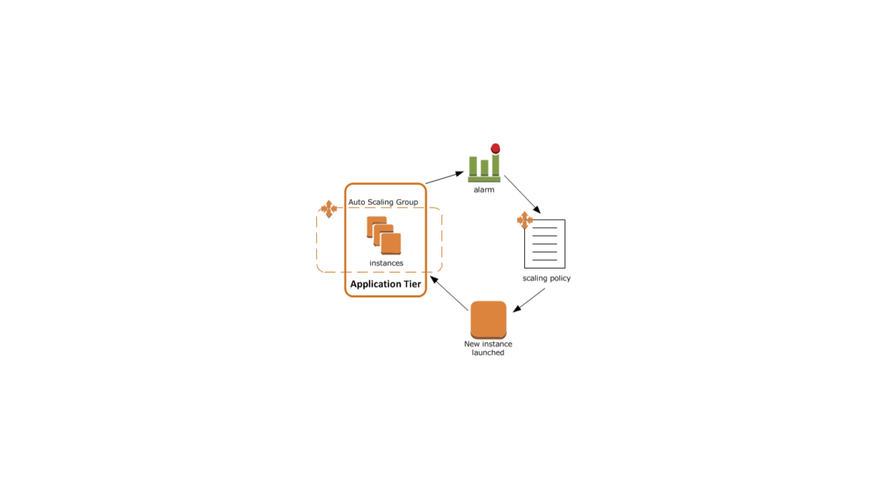

# monitor-ecs-cluster-enis

Currently ECS containers launched in “awsvpc” mode require each task to have a dedicated elastic network interface assigned. This creates a provisioning issue on the cluster when the ec2 instance type in the cluster can no longer attach additional interfaces to the tasks once the capacity on the hosts is reached.

To avoid provisioning errors of new tasks on the cluster a custom lambda is created to monitor the ECS cluster ENI’s (Elastic Network Interface). Once a particular threshold is met the cluster will add an additional EC2 instance to the cluster and allow new tasks to be provisioned.

 


Task Networking: awsvpc mode

The awsvpc network mode for ECS assigns each task a dedicated network interface on the host. This enables each task to have its own elastic network interface, a primary private IP address and an internal DNS hostname. The main benefit here is that it allows each task to be secured using security groups and grants more visibility with network monitoring tools.

https://docs.aws.amazon.com/AmazonECS/latest/developerguide/task-networking.html 

Instructions
-----------------------------------------------
Note: the documentation below assumes you have already deployed an ECS cluster in the environment.

1.	Create a CloudWatch rule with the following event pattern.

CloudWatch Event Pattern: 

This CWE rule is designed to analyze all ECS events on the account and trigger a lambda function to post custom CloudWatch metrics for the remaining CPU, MEM, and ENIs on the selected cluster.

```
RULE: ecs-resources-available-on-cluster

{
    "source": [
        "aws.ecs"
    ],
    "detail-type": [
        "ECS Task State Change",
        "ECS Container Instance State Change"
    ]
}
```
2. Create Lambda function for the ECS custom resource monitoring for ENI’s, CPU and MEM on the assigned cluster.

```
ecs-autoscalingV3.py
```
3.	Create a CloudWatch Alarm based on the custom metrics produced by the cluster in the auto scaling-group.


